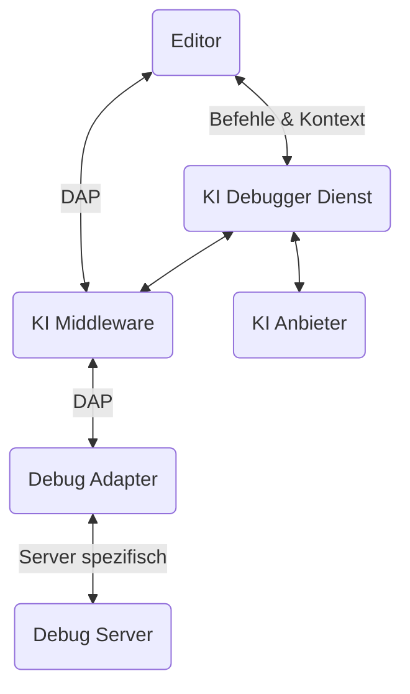

```mermaid
flowchart TD
    Editor(Editor) <--DAP--> Middleware
    Middleware(KI Middleware) <--DAP--> DA
    DA(Debug Adapter) <--Server spezifisch--> DS
    DS(Debug Server)
    KIDebugger(KI Debugger Dienst) <--> Middleware
    KIDebugger <--> Provider(KI Anbieter)
    Editor <--Befehle & Kontext--> KIDebugger
```